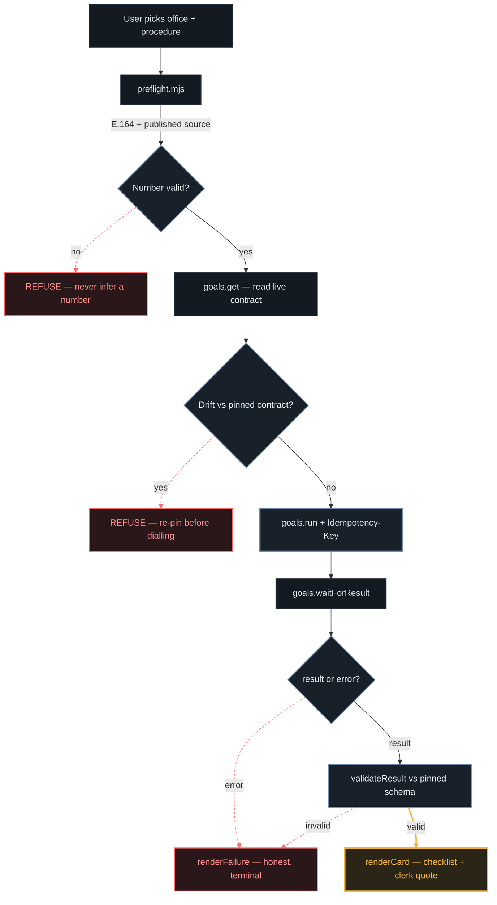

<!--
  PENDING before submission — grep this file for "PENDING" and resolve every hit:
  1. Hero image + icon. assets/readme-hero-animated.svg and readme-hero.png both render an
     INVENTED call (Rp 650.000) and are blocked by assets/ASSETS.md until re-exported from
     a real goals.run result. assets/icon.svg is clean — /publish copies it to docs/.
  2. The Engineering Rigor benchmark rows — fill from `npm run bench -- --report`.
  3. CI + Release badges — need a GitHub remote; both 404 until one exists.
  4. Demo video URL, repo URL, judge demo link.
-->

<div align="center">
  <h1>CounterCall 📞</h1>
  <p><em>Before you lose a morning at the counter, CALL-E phones the office and tells you exactly what to bring.</em></p>

  <br/>

  [](https://countercall.edycu.dev)
  [](https://countercall.edycu.dev/pitch/)
  [](https://countercall.edycu.dev/architecture/)

  [](https://call-e.devpost.com/)
  [](JUDGE.md)

  <br/>

  
  
  
  [](https://github.com/edycutjong/countercall/actions/workflows/ci.yml)
  [](https://github.com/edycutjong/countercall/releases)
  
  [](https://opensource.org/licenses/MIT)

</div>

---

## 💡 The Problem & Solution

### The Problem

In Indonesia, finding out what to bring to a government counter means going there. The
published page is stale or silent, the phone line is an IVR followed by hold music, and the
answer that actually matters — *do they take card, do I need the original, do I need an
appointment first* — lives only in a clerk's head. So people take a morning off, queue, and
get sent home for a missing photocopy.

### The Solution

**CounterCall** phones the office for you. CALL-E dials the published enquiries line, waits
through the IVR, asks one factual question a clerk answers a dozen times a day, and returns
a **validated checklist**: the documents in the clerk's own words, the fee, cash or card,
originals or copies, whether you need an appointment — plus the verbatim line the clerk
said, so you can judge the answer yourself.

When the clerk is unsure, it says so. When the line does not answer, it says that too. It
never invents a fee.

```
━━━━━━━━━━━━━━━━━━━━━━━━━━━━━━━━━━━━━━━━━━━━━━━━━━━━━━━━━━━━━━━━━━
  Kantor Imigrasi Jakarta Selatan
  perpanjangan paspor
━━━━━━━━━━━━━━━━━━━━━━━━━━━━━━━━━━━━━━━━━━━━━━━━━━━━━━━━━━━━━━━━━━

  BRING
    • KTP asli
    • Kartu Keluarga asli
    • paspor lama

  Documents             Originals
  Fee                   —
  Payment               Cash
  Appointment           Yes — book before going

──────────────────────────────────────────────────────────────────
  The clerk was unsure. Verify these details in person.

  In the clerk's words:
    "Untuk biayanya saya kurang tahu, nanti ditanyakan di loket
     saja."
━━━━━━━━━━━━━━━━━━━━━━━━━━━━━━━━━━━━━━━━━━━━━━━━━━━━━━━━━━━━━━━━━━
```

The Fee row is empty because the clerk did not know. That is a **successful** call — the
user learns three documents and an appointment requirement, and knows to ask about the fee
at the window. An unknown fee costs one question at the counter; an invented one costs the
trip.

## 🏗️ Architecture & Tech Stack

> **[→ Open the interactive architecture diagram](https://countercall.edycu.dev/architecture/)**
> — every surface, every refusal, and the exact file and line each one lives at.

<details>
<summary><b>Or read the same flow inline (Mermaid)</b></summary>

<br/>

Colour carries meaning here, the same as everywhere else in this project: **steel** is a step
taken before anyone has answered, **red** renders no checklist at all, and **amber** appears
exactly once — on the only node that carries something a clerk actually said.



</details>

| Layer | Technology |
|---|---|
| **Voice + extraction** | CALL-E Goals API (`@call-e/calle` 0.7.0) |
| **Runtime** | Node ≥ 20, ESM, one runtime dependency |
| **Contract** | Pinned `result_schema`, `additionalProperties: false`, drift guard |
| **Distribution** | Agent Skill package (`skills/countercall/`) |
| **CI/CD** | 6-stage GitHub Actions · CodeQL · gitleaks · TruffleHog · Dependabot |

## 🏆 CALL-E Integration

Delete CALL-E and there is no project. There is no scraped-website fallback and no cached
requirements database — deliberately. The entire value is that a **phone call happened** and
a human answered.

Four Goals API methods are load-bearing:

| Method | Role | Code |
|---|---|---|
| `goals.list` | Discovers the published procedure catalogue — the reuse mechanism itself | `scripts/verify_calle.mjs` |
| `goals.get` | Reads the live pinned `input_schema` / `result_schema` before every dial | `skills/countercall/scripts/preflight.mjs` |
| `goals.run` | Places the call, with a required business-stable `Idempotency-Key` | `skills/countercall/scripts/call.mjs` |
| `goals.waitForResult` | Polls to a validated result or a terminal `GoalRunError` | `skills/countercall/scripts/call.mjs` |

Plus two protocol surfaces doing real work rather than decorating: the pinned `result_schema`
with `additionalProperties: false` — which turns a malformed answer into a *detectable*
failure instead of a silently accepted wrong checklist — and `GoalRunError.code` routed
exhaustively to eight distinct user-facing outcomes.

**Honest limitations.** A Goal Run result is a flat map of scalars — no arrays, no nested
objects, no nulls. The document checklist is therefore carried as a newline-separated string
and decoded client-side, and the fee is an *optional* field that is simply absent when the
clerk did not know, because `null` is not a permitted value. Both are documented in
[`contract.mjs`](skills/countercall/scripts/contract.mjs). Separately: Goals are owner-scoped
and authored only in CALL-E Chat, so what this repo publishes for the community is the Goal
**specification** plus the client, not a runnable shared Goal.

## 📊 Engineering Rigor

| Metric | Value |
|---|---|
| Tests | **233**, passing, no credentials required |
| Contract cases exhaustively verified | **11,520** |
| Live CALL-E integration tests | **12** — real API reads, skipped loudly without a key |
| CALL-E error codes routed | **8 of 8** in the published schema |
| Runtime dependencies | **1** (`@call-e/calle`) |
| CI pipeline | 6 stages, parallel, with concurrency control |

<!-- PENDING: add from `npm run bench -- --report` once real calls exist.
     | Real calls placed | N |  | Line answered | N (X%) |
     | p50 / p95 dial → validated checklist | Xs / Xs |
     bench.mjs refuses to render a table from zero records, by design. -->

**Where 11,520 comes from.** `validateResult` + `renderCard` are the decision function that
must never be wrong — everything downstream is a person deciding whether to travel across a
city. Rather than test them on examples, [`test/exhaustive.test.mjs`](test/exhaustive.test.mjs)
walks the entire input space the contract permits: 1,296 valid results validated, 1,296
rendered cards checked for invented values, 8,208 single-field corruptions rejected, 720
unexpected-key injections rejected. The sweep found a real defect while being written — an
empty `clerk_quote` validated clean, which would have rendered a card that looks sourced and
is not.

The live tests **skip loudly** without `CALLE_API_KEY` rather than passing quietly. A suite
that goes green with the network unplugged proves nothing about the integration it exists to
defend, so the two counts are stated separately and never added together.

## 🛡️ Calling a Public Service Counter

This project points an automated caller at a phone line staffed by someone who did not opt
in. That asymmetry drives the rules in
[`references/safety.md`](skills/countercall/references/safety.md): a stated consent line and
an immediate stop on refusal; one call per office, per procedure, per day, enforced by the
idempotency key; published general-enquiries lines only, during opening hours; never a
personal mobile, never an emergency or crisis line; and no personal data sent as a call
variable — the clerk is being asked about a procedure, not about a person.

CounterCall **never infers a phone number**. A number enters the seed file only when a human
has read it off the office's own published page and recorded the URL and the date they
checked it. [`test/boundary.test.mjs`](test/boundary.test.mjs) asserts this holds by driving
the shipped entry points as subprocesses and attempting to make each of them dial something
it must refuse — with credentials present and `--live` requested.

## 🚀 Getting Started

### Prerequisites

- Node.js ≥ 20
- npm
- *(optional)* a CALL-E Developer API key — only needed to place a real call

### Installation

```bash
git clone <REPO_URL> && cd countercall   # PENDING: repo URL
npm install
npm test                                  # 233 tests, no credentials needed
```

Then, without placing a call:

```bash
node skills/countercall/scripts/preflight.mjs \
  --office imigrasi-jaksel --procedure "perpanjangan paspor"
```

`preflight` validates the number, checks the live Goal contract against the pinned one, and
prints the idempotency key it would use. To see the exact request that would be sent — still
without dialling — run `call.mjs` with the same flags. Add `--live` to actually ring a phone.
**It is never the default.**

## 🧪 Testing & CI

```bash
# ── Code Quality ────────────────────────────
npm run lint          # eslint
npm test              # 233 tests
npm run test:coverage # coverage report
npm run ci            # lint + test + audit

# ── CALL-E ──────────────────────────────────
CALLE_API_KEY=... npm test     # + 12 live reads (no call placed, no credit spent)
npm run bench -- --plan        # print the call plan, dial nothing
make security-scan             # npm audit + licenses + gitleaks over full history
```

| Layer | Tool | Status |
|---|---|---|
| Code Quality | ESLint (flat config) | ✅ |
| Unit + Contract Testing | `node:test`, 233 tests | ✅ |
| Exhaustive Verification | 11,520 contract cases | ✅ |
| Safety Boundary | Subprocess refuse-to-dial suite | ✅ |
| Security (SAST) | CodeQL | ✅ |
| Security (SCA) | Dependabot + npm audit | ✅ |
| Secret Scanning | TruffleHog + gitleaks (full history) | ✅ |
| CI/CD Pipeline | 6-stage GitHub Actions | ✅ |

## 📁 Project Structure

```
countercall/
├── skills/countercall/     # the Agent Skill package — the community artifact
│   ├── SKILL.md
│   ├── data/offices.json   # every number carries a source URL + check date
│   ├── references/         # safety rules, result contract, worked examples
│   └── scripts/            # preflight · call · contract · render · _lib
├── scripts/                # verify_calle · bench · bench_stats
├── test/                   # 233 tests across 8 suites
├── .github/workflows/      # ci · codeql · gitleaks · release
├── JUDGE.md                # the 30-second judge path
└── README.md               # you are here
```

## 🗺️ Roadmap

- [x] CALL-E Goals API integration — 4 load-bearing methods
- [x] Pinned result contract + drift guard
- [x] Agent Skill package with dry-run-by-default CLI
- [x] 233 tests · 11,520 exhaustively verified contract cases
- [x] 6-stage CI/CD, CodeQL, gitleaks, Dependabot
- [ ] Publish the Goal in CALL-E Chat and place the first real call
- [ ] Benchmark ≥ 20 real calls, publish p50/p95 and the honest answer rate
- [ ] Community-contributed offices beyond the seed set

## 📽️ Demo Materials

- **For judges:** [JUDGE.md](JUDGE.md) — the claim, the 30-second path, the receipts
- **Demo video:** <!-- PENDING: video URL (public, YouTube or Vimeo, under 3 minutes) -->
- **Live proof:** <!-- PENDING: DEMO.md with a real call's runId -->

## 📄 License

[MIT](LICENSE) © 2026 Edy Cu

## 🙏 Acknowledgments

Built for the [CALL-E Hackathon](https://call-e.devpost.com/). Thank you to the CALL-E team
for the Goals API, and for answering schema questions on Discord.
