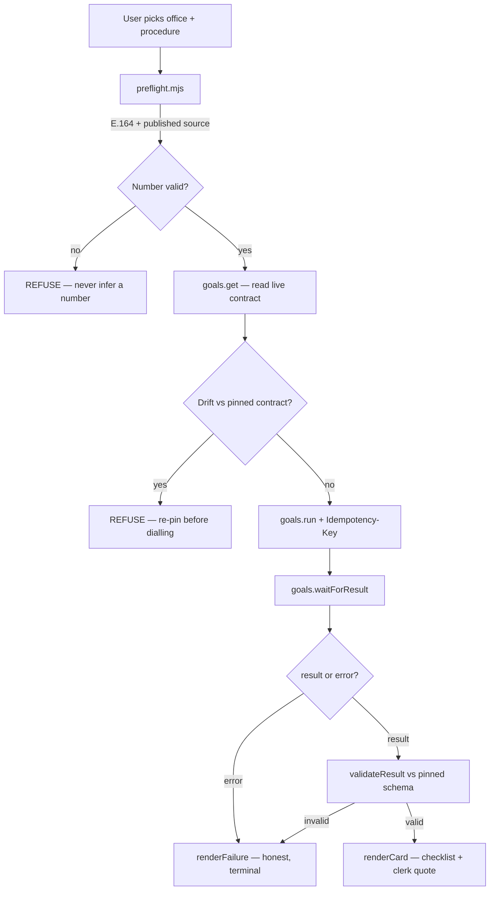

<!--
  PENDING before submission — grep this file for "PENDING" and resolve every hit:
  1. Hero image. assets/readme-hero-animated.svg and readme-hero.png both render an
     INVENTED call (Rp 650.000). Blocked by assets/ASSETS.md until re-exported from a
     real goals.run result. Embed via /publish once real.
  2. The Engineering Rigor benchmark rows — fill from `npm run bench -- --report`.
  3. The live-verification line in "Why CALL-E" — needs real run ids.
  4. Demo video URL and judge demo URL.
-->

# CounterCall

> Before you lose a morning at the immigration counter, CALL-E phones the office, survives
> the IVR and the hold, and hands back exactly what to bring.

[](#-engineering-rigor)
[](#-why-call-e)
[](package.json)
[](LICENSE)

## The problem

In Indonesia, finding out what to bring to a government counter means going there. The
published page is stale or silent, the phone line is an IVR followed by hold music, and the
answer that actually matters — *do they take card, do I need the original, do I need an
appointment first* — lives only in a clerk's head. So people take a morning off, queue, and
get sent home for a missing photocopy.

## The solution

CounterCall phones the office for you. CALL-E dials the published enquiries line, waits
through the IVR, asks one factual question a clerk answers a dozen times a day, and returns
a **validated checklist**: the documents in the clerk's own words, the fee, cash or card,
originals or copies, whether you need an appointment — plus the verbatim line the clerk
said, so you can judge the answer yourself.

When the clerk is unsure, it says so. When the line does not answer, it says that too. It
never invents a fee.

## ⚡ Quick start

```bash
git clone <REPO_URL> && cd countercall
npm install
npm test                     # 182 offline tests, no credentials needed
```

Then, without placing a call:

```bash
node skills/countercall/scripts/preflight.mjs \
  --office imigrasi-jaksel --procedure "perpanjangan paspor"
```

`preflight` validates the number, checks the live Goal contract against the pinned one, and
prints the idempotency key it would use. To see the exact request that would be sent —
still without dialling:

```bash
node skills/countercall/scripts/call.mjs \
  --office imigrasi-jaksel --procedure "perpanjangan paspor"
```

Add `--live` to actually ring a phone. It is never the default.

## 🏗️ Architecture



| Layer | Technology |
|---|---|
| Voice + extraction | **CALL-E Goals API** (`@call-e/calle` 0.7.0) |
| Runtime | Node ≥ 20, ESM, zero runtime dependencies beyond the CALL-E SDK |
| Contract | Pinned `result_schema`, `additionalProperties: false`, drift guard |
| Distribution | Agent Skill package (`skills/countercall/`) |

## 🔑 Key features

- **Refuses to dial a number it cannot source.** Every office number must be E.164 *and*
  carry the URL and date a human read it off the office's own page. A placeholder or a
  local-format number is rejected before the dialler sees it.
- **Contract-drift guard.** `goals.get` reads the live published interface before every
  run and compares it to the schema this build was pinned against. Any version bump, added
  field, removed field, or opened `additionalProperties` refuses the call. A drifted schema
  does not throw — it silently returns confident-looking wrong answers, which is the exact
  failure a checklist must never have.
- **Business-stable idempotency.** The key is `countercall:{office}:{procedure}:{date}:v1`,
  so a retry cannot double-dial a public service line. These are queues with real people
  in them, not an API.
- **Uncertainty is a first-class result.** `clerk_certainty` distinguishes *confident* from
  *unsure* from *refused*. A field the clerk did not know renders as an em dash — never a
  typical value, never silently dropped. An unknown fee costs you one question at the
  counter; an invented one costs you the trip.
- **Honest failure.** `no_answer`, `declined`, `result_invalid` and every other
  `GoalRunError` code render a distinct, truthful outcome. No branch produces a partial
  checklist.
- **Dry run by default.** A skill that dials by default is a skill that dials by accident.

## 📊 Engineering rigor

| Metric | Value |
|---|---|
| Offline tests | **182** — run with no credentials and no network |
| Live integration tests | **12** — real reads against the CALL-E Developer API |
| Runtime dependencies | 1 (`@call-e/calle`) |
| CALL-E error codes routed | 8 of 8 in the published schema |

<!-- PENDING: add these rows from `npm run bench -- --report` once real calls exist.
     | Real calls placed | N |
     | Line answered | N (X%) |
     | p50 / p95 dial → validated checklist | Xs / Xs |
     bench.mjs refuses to render a table from zero records, by design. -->

The live tests **skip loudly** without `CALLE_API_KEY` rather than passing quietly. A suite
that goes green with the network unplugged proves nothing about the integration it exists
to defend, so the two counts are stated separately and never added together.

```bash
npm test                                    # 182 offline
CALLE_API_KEY=... npm test                  # + 12 live reads (no call placed, no credit spent)
npm run bench -- --plan --calls 20          # show the call plan, dial nothing
```

## 🏆 Why CALL-E

Delete CALL-E and there is no project. There is no scraped-website fallback and no cached
requirements database — deliberately. The entire value is that a **phone call happened** and
a human answered.

Four Goals API methods are load-bearing:

| Method | Role |
|---|---|
| `goals.list` | Discovers the published procedure catalogue — the reuse mechanism itself |
| `goals.get` | Reads the live pinned `input_schema` / `result_schema` before every dial |
| `goals.run` | Places the call, with a required business-stable `Idempotency-Key` |
| `goals.waitForResult` | Polls to a validated result or a terminal `GoalRunError` |

Plus two protocol surfaces that are doing real work rather than decorating: the pinned
`result_schema` with `additionalProperties: false` (which turns a malformed answer into a
*detectable* failure instead of a silently accepted wrong checklist), and `GoalRunError.code`
routed exhaustively to distinct user-facing outcomes.

**Honest limitations.** A Goal Run result is a flat map of scalars — no arrays, no nested
objects, no nulls. The document checklist is therefore carried as a newline-separated string
and decoded client-side, and the fee is an *optional* field that is simply absent when the
clerk did not know, because `null` is not a permitted value. Both are documented in
`skills/countercall/scripts/contract.mjs`. Separately: Goals are owner-scoped and authored
only in CALL-E Chat, so what this repo publishes for the community is the Goal
**specification** plus the client, not a runnable shared Goal.

<!-- PENDING: "Verified live on <date> — run ids grun_..., grun_..., grun_..." -->

## 🛡️ Calling a public service counter

This project points an automated caller at a phone line staffed by someone who did not opt
in. That asymmetry drives the rules in
[`skills/countercall/references/safety.md`](skills/countercall/references/safety.md):
a stated consent line and an immediate stop on refusal; one call per office, per procedure,
per day; published general-enquiries lines only, during opening hours; never a personal
mobile, never an emergency or crisis line; and no personal data sent as a call variable —
the clerk is being asked about a procedure, not about a person.

## 📽️ Demo

<!-- PENDING: demo video URL (public, YouTube or Vimeo, under 3 minutes) -->
<!-- PENDING: judge demo URL, free and live through 2026-10-13 -->

## 📄 License

MIT — see [LICENSE](LICENSE).
